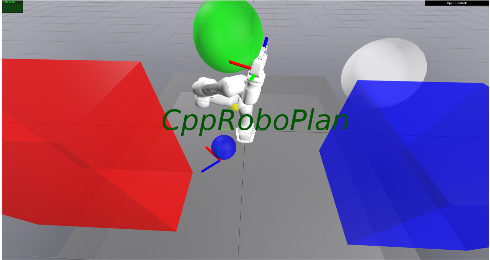

# Educational C++ library for robotic manipulator applications.

CppRoboPlan is a modern **C++ educational motion planning** library designed for robotic manipulator applications.
It provides fundamental tools for building planning pipelines, including configuration space modeling, collision checking, and both roadmap- and sampling-based planners.

The goal of CppRoboPlan is to offer a fast, modular, and lightweight educational and prototyping alternative to existing robotics planning frameworks, written entirely in C++ with CMake-based builds.

⚡ Emphasis on Educational and Prototyping: The methods provided here may not represent the most optimized or production-ready implementations. Instead, the library serves as a playground for roboticists to rapidly prototype planning and control methods with minimal external package dependencies.

### Acknowledgmentst :
This project is inspired by [pyroboplan](https://github.com/sea-bass/pyroboplan) , created by Sebastian Castro, with the goal of building a C++ mirror. Many ideas and references are drawn from pyroboplan, and I am thankful to Sebastian for making it available as an open-source project.

CppRoboPlan also makes use of the excellent [Pinocchio](https://github.com/stack-of-tasks/pinocchio) library for efficient kinematics and dynamics computations in robotics, and [Drake](https://github.com/RobotLocomotion/drake) for Meshcat-based visualization.

## Installation and Documentation 
For installation instructions and full documentation, please refer to the Project Website.

## Demo video
You may download the videos Example from /assets/video
### RRT Connect Demo ( examples/RRTConnectPlanner/main.cpp )

https://github.com/user-attachments/assets/570a6e85-a6f4-4c99-bc30-bf26266fa9af

### Differential Inverse Kinematics Example (examples/InverseKinematics/main.cpp)

https://github.com/user-attachments/assets/8bcb1e3b-c6e0-43a4-b92b-e1f1be805daa

## ToDO:
1. The next release will remove the redundant use of std::vector with Eigen matrices and vectors.